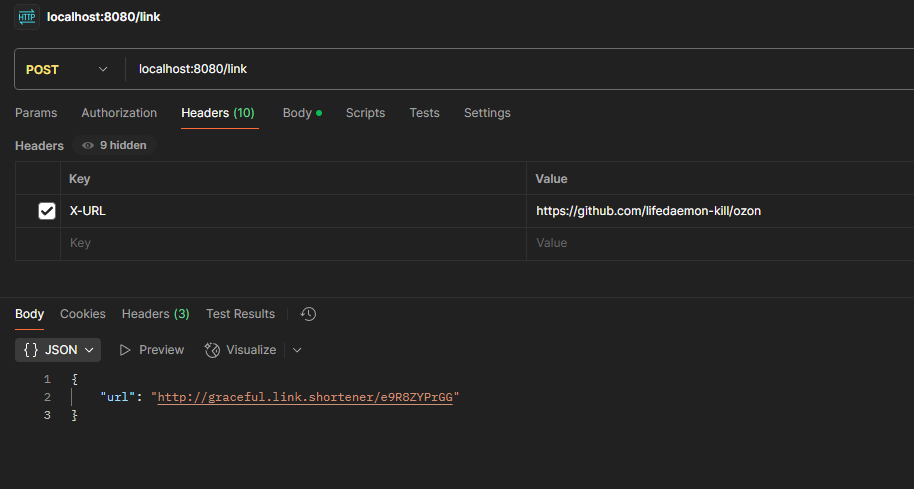
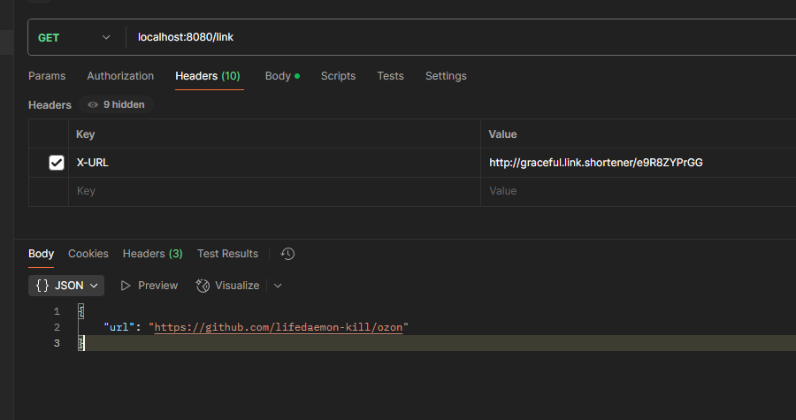
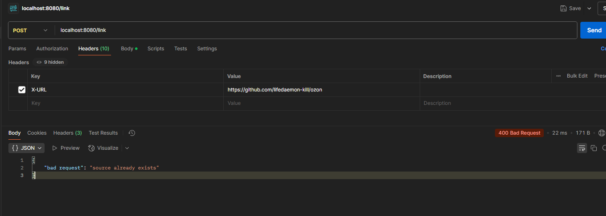
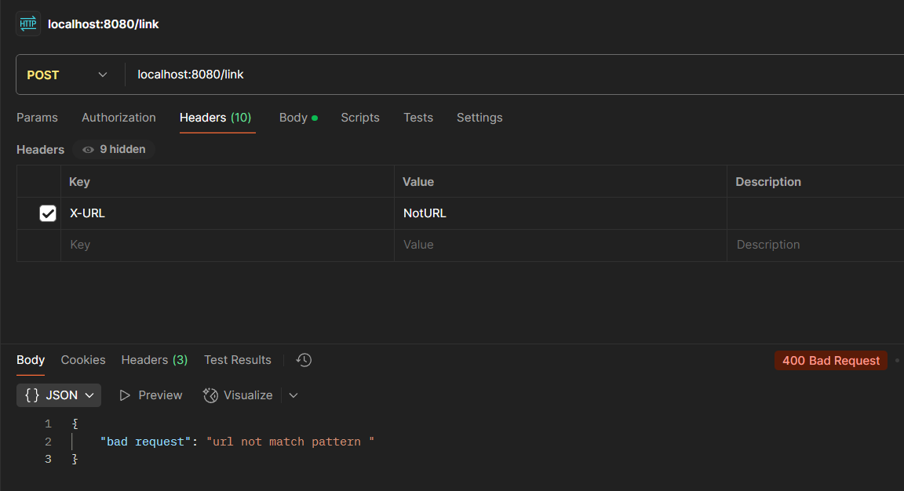
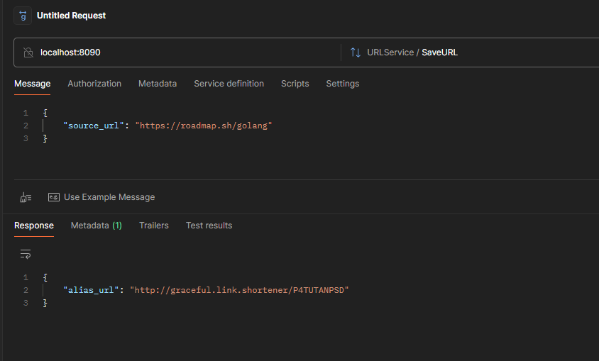
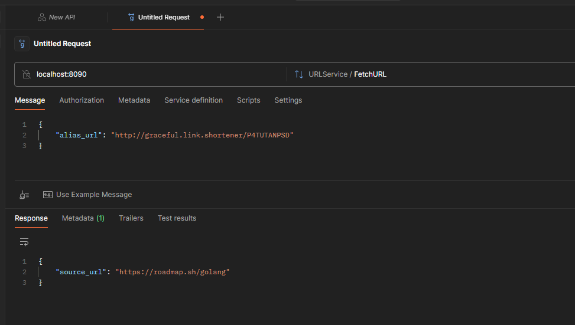

# URL Shortener API

## Тестовое задание для стажера-разработчика

---

# Оглавление

1. [Запуск](#запуск)
2. [Описание API](#описание-api)
    - [REST API](#rest-api)
        - [Эндпоинты](#эндпоинты)
    - [gRPC API](#grpc-api)
        - [Сервис URLService](#сервис-urlservice)
        - [Структуры](#структуры)
3. [Protobuf](#protobuf)
4. [Миграции](#миграции)
5. [Хранилище](#хранилище)
6. [Генерация URL](#генерация-url)
    - [Методы](#методы)
    - [Среднее время выполнения](#среднее-время-выполнения)
7. [Пример работы](#пример-работы)

---

## Запуск

Осуществляется через `docker-compose up`

Желательно в файле поменять пароли на более устойчивые

---
## Описание API

Поддерживаются два сервиса
REST и gRPC

## 1. REST

 port: `8080`

### Доступны эндпоинты

1. `GET /link`
   Вытягивает из хранилища оригинальную ссылку по псевдониму
   
   Принимает header

   `"X-URL" : string`

   Возвращает application/json
   ```json
   {
      "url": "string"
   }
   ```
2. `POST /link`
   Для исходной ссылки создает псевдоним и возвращает его
 
   Принимает header
   `"X-URL" : string`

    Возвращает application/json
    
    ```json
    {
      "url": "string"
    }
    ```

## 2. GRPC
port: `8090`

### URLService

#### Методы

1. `rpc SaveURL(SaveURLRequest) returns (SaveURLResponse);`
2. `rpc FetchURL(FetchURLRequest) returns (FetchURLResponse);`

### Структуры

```
message SaveURLRequest {
string source_URL = 1;
}

message SaveURLResponse{
string alias_URL = 1;
}

message FetchURLRequest {
string alias_URL = 1;
}

message FetchURLResponse {
string source_URL = 1;
}
```

---

## Protobuf

Генерация `proto` файлов осуществляется с помощью `Makefile` в папке `pkg/grpc`

1. `make url_gen`

---

## Миграции

Осуществляются с помощью `Makefile` утилитой `goose` (только для `postgres`)

Командой

1. `make migrate_pg`
2. `make reset_pg`

---

## Хранилище

Для выбора хранилища нужно дописать тэг `-s` и тип бд: `postgres` или `inmemory` в докер файлы

```
go run ./cmd/server/main.go -s postgres
storage type: postgres

go run ./cmd/server/main.go
storage type: postgres
```

```
go run ./cmd/server/main.go -s inmemory
storage type: inmemory
```

Если не указывать ничего, по умолчанию выберется `postgres`

---

# Генерация URL

Исходник: `internal/pkg/lib/url_generate.go`

Тесты: `internal/pkg/lib/url_generate_test.go`

Я сделал три метода, чтобы протестировать их скорость работы под большой нагрузкой, и найти наиболее быстрый

Для генерации я использовал `math/rand`, ввиду того, что `crypto/rand` работает в 10 раз медленнее

### Методы:

1. `GenerateLinkStrBuilder` - Создает строку через str builder и math rand
2. `generateLinkLinear` - Создает массив рун, заполняя каждую линейно и возвращает конкатенацию методом string
3. `generateLinkParallel` - Попытка улучшить 3 метод, за счет того, что на каждый элемент массива будет запускаться своя
   горутина

### Среднее для 30 запусков по 600,000 раз:

1. `163.75 ms`
2. `227.92 ms`
3. `6492.66 ms`

По результатам видно, что билдер сработал быстрее чем преобразование рун в строку,
А создание горутин занимает значительно больше времени, чем обращение к генератору случайных чисел линейно
поэтому я оставил только самый эффективный метод, а остальные пометил как устаревшие и ограничил область видимости

## Пример работы

http и gRPC
я тестировал с помощью postman

# Http

## Создание



## Вытягивание



## При повторном создании возвращает ошибку



## Если отправляем не ссылку



---

# gRPC

### Создание ссылки



### Вытягивание



Все эндпоинты функционируют в штатном режиме
